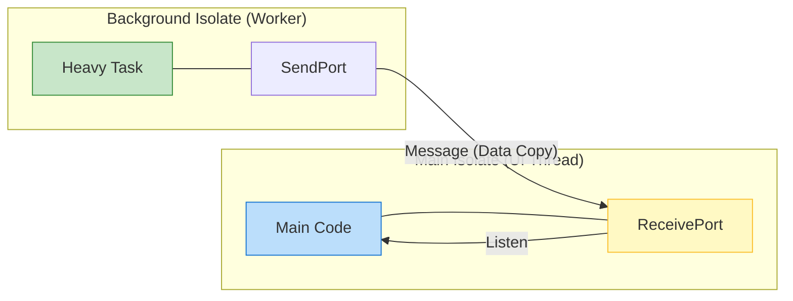

# Advanced Dart Concurrency: Beyond Simple Await

To master Flutter, you must understand how Dart handles concurrency without multi-threading in the traditional sense. This is the realm of **Isolates** and the **Microtask Queue**.

## 1. The Single-Threaded Myth

While Dart runs on a single thread (the Main Isolate), it is highly concurrent. The secret is the **Event Loop**, which you've already seen, but as a senior, you need to understand the **priority levels**.

### Task Priority Hierarchy:
1.  **Synchronous Code**: Executes immediately.
2.  **Microtasks**: Scheduled via `Future.microtask`. Runs *before* the next event.
3.  **Events**: Scheduled via `Future`, `Timer`, or UI interactions.

---

## 2. Advanced `async` / `await` Patterns

A PhD-level engineer knows that `await` is just syntactic sugar for a microtask continuation.

### Scenario: The "Three Awaits" Performance
```dart
Future<void> complexSequence() async {
  print("1: Start"); 
  
  await firstStep(); // Current function pauses, returns a Future.
  // Code below becomes a microtask.
  
  print("2: Resumed");
  
  await secondStep(); 
  // Code below becomes ANOTHER microtask.
  
  print("3: Finished");
}
```

### Pro Tip: Async without Await
Sometimes you want to fire-and-forget or run things in parallel:
```dart
void parallelExecution() {
  // These start simultaneously
  fetchDataA().then((res) => print("A done"));
  fetchDataB().then((res) => print("B done"));
  
  print("Execution continues immediately without waiting for A or B");
}
```

---

## 3. Isolates: True Parallelism

When you have a CPU-intensive task (like parsing 50MB of JSON or image processing), you **must** use a separate Isolate.

- **Shared Nothing**: Isolates do not share memory. They communicate via **Port passing**.
- **The Cost**: Spawning an Isolate is expensive (~2MB overhead + startup time). Use `Isolate.run()` for one-off tasks.

### Senior Isolate Pattern:
```dart
import 'dart:isolate';

Future<List<Data>> fetchAndParseHeavy() async {
  // isolate.run abstracts the port setup for you
  return await Isolate.run(() {
    // This runs on a separate CPU core
    final data = _heavyCalculation();
    return data;
  });
}
```

---

## 4. Visualizing Concurrency



---

## 5. Senior Insight: The Microtask Trap

If you schedule a microtask that schedules another microtask, you can **starve the event loop**.

> [!CAUTION]
> **Death by Microtask**: Since microtasks have priority over events (like UI frames), an infinite loop of microtasks will completely freeze your Flutter app, even if the "main" event loop isn't "blocked" in the traditional sense.

---

## 6. Real-World States: Streams and Generators

Advanced Flutter apps use `Stream` and `async*` (asynchronous generators) to handle sequences of data.

```dart
Stream<int> countUp(int n) async* {
  for (int i = 1; i <= n; i++) {
    await Future.delayed(Duration(seconds: 1));
    yield i; // Pushes value to stream and pauses
  }
}
```

By mastering this, you ensure your app is never sluggish, even when performing massive network or data operations in the background.
