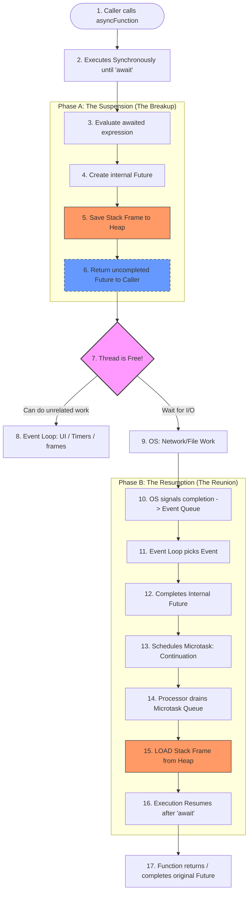
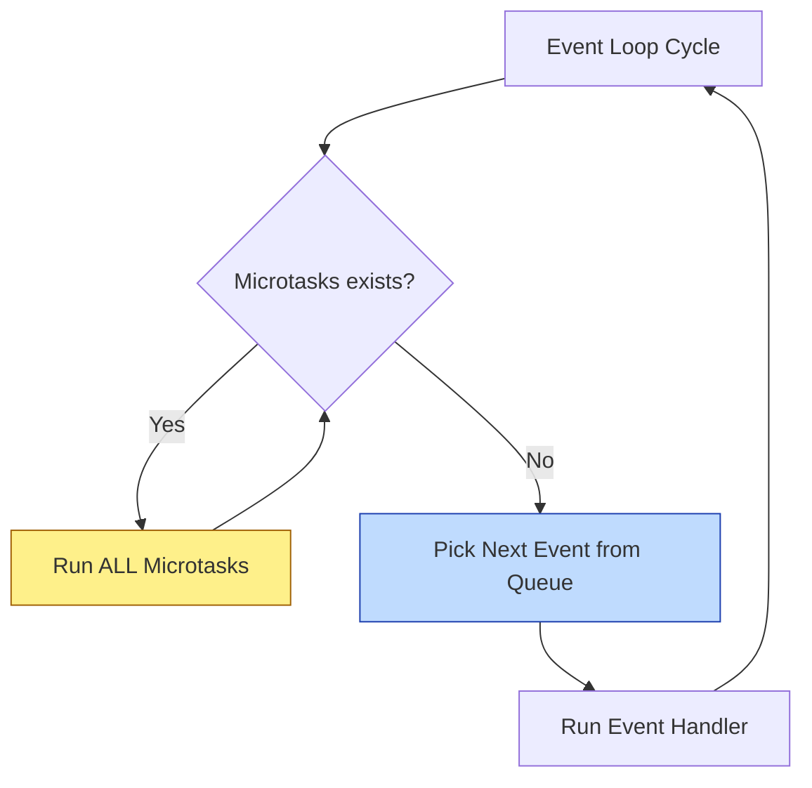
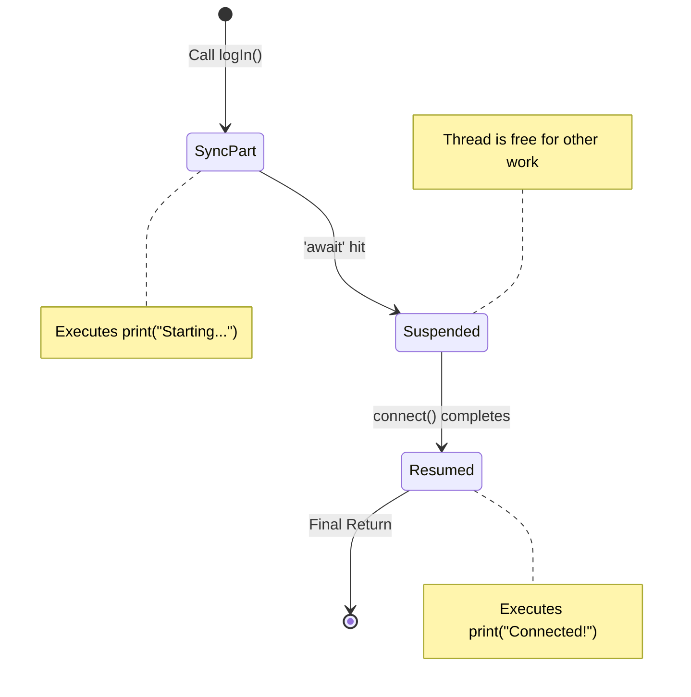
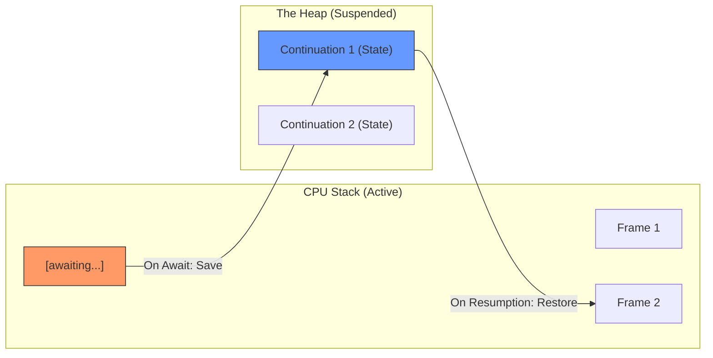

# Dart Async/Await: The Anatomy of a Suspension Point

To truly master Dart, you must understand that `await` is not a "wait" in the traditional sense. It is a **syntactic sugar for a state machine transformation**.

When you write `await`, you are telling the Dart VM: *"Take everything after this line, wrap it in a closure, and run it later when this Future completes."*

---

## 1. The Master Lifecycle: From Call to Completion

This unified diagram shows exactly what happens to the execution flow and the thread after the initial `Future` is returned.



---

## 2. What are "Stack Frames"?

To understand suspension, you must understand the **Stack Frame**. Think of a Frame as the "Snapshot" of a function's current physical state.

### The Anatomy of a Frame
Whenever a function is called, Dart's memory allocator carves out a block of memory (a Frame) that contains:
1.  **Local Variables**: Any variables declared inside the function (e.g., `int i = 0`).
2.  **Arguments**: The values passed into the function.
3.  **Instruction Pointer (IP)**: Exactly which line of code the CPU is currently reading.
4.  **Return Address**: Where to go when this function finishes.

### Suspension: Moving the Frame
In a standard synchronous function, the frame lives on the **C-Stack** (very fast, but volatile). 

When you `await`:
-   Dart **vacates** the stack. It physically copies your Frame (variables, IP, etc.) from the volatile stack into the **Heap** (permanent memory).
-   This is why we say the function is "suspended." The CPU literally forgets about it until it's pulled back.

### Resumption: Restoring the Frame
When the Microtask runs:
-   Dart finds your saved Frame on the Heap.
-   It copies it **back onto the Stack**.
-   It looks at the **Instruction Pointer** and says: *"Ah, we were on line 42. Let's start from line 43."*

---

## 3. In the Background: The Event Loop Perspective

As a senior engineer, you must visualize what happens in the **Microtask Queue** versus the **Event Queue**.

### Phase A: The Current Stack
1.  **Function Entry**: The function runs synchronously until the first `await`.
2.  **The Await Hit**:
    - The expression being awaited (e.g., `fetchData()`) is evaluated.
    - If it's a `Future`, Dart attaches a listener to it.
    - **Crucial**: The current function's execution state (local variables, stack pointer) is saved.
    - The function **exits** (returns a `Future`).

### Phase B: The Inter-Period
- The thread is now free. The Event Loop continues to process other events (UI taps, frames, other timers).
- The "rest" of your function is sitting in memory as a **continuation**.

### Phase C: Resumption (The Coordination)
This is where most developers get confused. Does the "Network Call" go into the Event Queue?

1.  **The Event Queue**: Does **NOT** contain your code. It contains a "Notification" from the Operating System. When a Network Request finishes, the OS signals Dart. That signal (the "Data is ready!") is an **Event**.
2.  **The Microtask Queue**: Contains your **Continuation** (the code after `await`).

**The Sequence of Success:**
- OS signals Dart -> **Event Queue** gets a "Completion Entry".
- Event Loop picks up that event -> It looks up which `Future` it belongs to.
- It "Completes" that `Future`.
- **IMMEDIATELY**, it schedules the `await` resumption as a **Microtask**.
- Because Microtasks have higher priority, your code runs **immediately after** the event loop finishes processing the "Completion Entry", and **before** it looks at the next UI tap or Timer in the Event Queue.

### Visualizing Loop Priority



---

## 4. Visualizing the I/O Handshake

Internally, the Dart compiler transforms an `async` function into a class that implements a state machine.

```dart
// WHAT YOU WRITE:
Future<void> logIn() async {
  print("Starting...");
  await connect();
  print("Connected!");
}

// CONCEPTUAL VIEW OF WHAT DART DOES (Simplified):
class LogInStateMachine {
  int state = 0;
  
  void moveNext(Variant result) {
    switch (state) {
      case 0:
        print("Starting...");
        state = 1;
        connect().then((val) => moveNext(val)); // Schedule next state
        return; // EXIT FUNCTION, RETURN FUTURE
      case 1:
        print("Connected!");
        // Complete the return Future
    }
  }
}
```

### Visualizing the State Machine Transformation



---

## 4. Why `await` schedules a Microtask?

Resumption is placed in the **Microtask Queue** because:
- **Consistency**: You want the logic to finish as soon as possible after the dependency is met, before the user can trigger another "Event" (like another button tap).
- **Atomicity**: It ensures that related logic flows are completed "together" without being interrupted by unrelated events in the event queue.

---

## 5. Visualizing Memory vs Execution

> [!IMPORTANT]
> **Memory Perspective**: When a function is suspended, it is moved from the **Stack** (active execution) to the **Heap** (stored state). When it resumes, it is pulled back onto the stack.

### Visualizing Memory vs Execution (MD Version)

> [!IMPORTANT]
> **Memory Perspective**: When a function is suspended, it is moved from the **Stack** (active execution) to the **Heap** (stored state). When it resumes, it is pulled back onto the stack.



*The diagram above illustrates the transition: Code moves from the **Execution Stack** to a **Suspended State (Heap)**, then enters the **Microtask Queue** to eventually return to the Stack.*

---

## 6. The "Execution Gap" (PhD Deep Dive)

A common point of confusion is how "blocks" of sync code are treated. If you have sync code before and after an `await`, they are **not** part of the same execution cycle.

```dart
void demo() async {
  print("1. Sync"); // Phase A
  print("2. Sync"); // Phase A
  await future;    // THE GAP (Suspension)
  print("4. Sync"); // Phase B (Resumption)
  print("5. Sync"); // Phase B (Resumption)
}
```

### Visualizing the Timeline

```mermaid
gantt
    title The Timeline of a Single Function
    dateFormat  X
    axisFormat %s
    
    section Thread Execution
    Sync Phase A (1, 2) :0, 2
    Thread is FREE (Gap)   :2, 6
    Sync Phase B (4, 5) :6, 8
```



> [!IMPORTANT]
> **The Verdict**: Lines 1 and 2 are executed synchronously **immediately**. Lines 4 and 5 are executed synchronously **later**. They are strictly separated by the suspension. During "The Gap", the UI doesn't freeze because the function has physically exited the C-Stack.

---

## Senior Level Takeaway

- **`await` is a return statement**: It returns a `Future` to the caller.
- **`async` doesn't mean background thread**: Everything still runs on the single Isolate thread.
- **Concurrency is Interleaving**: Dart achieves "concurrency" by breaking functions into small pieces (continuations) and interleaving their execution between other events.
