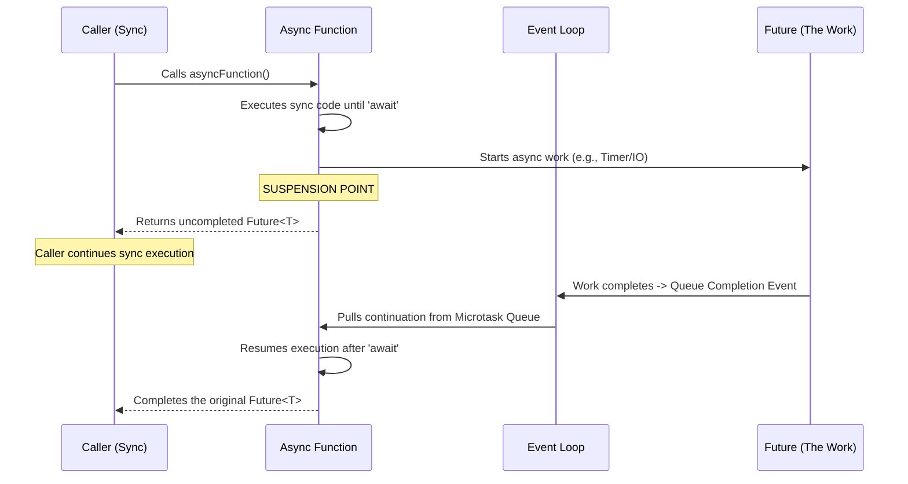
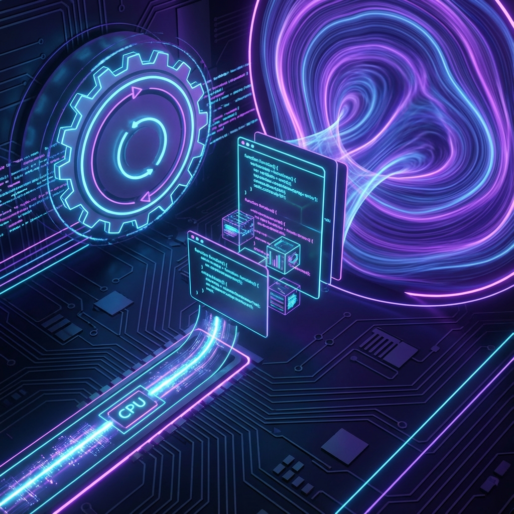

# Dart Async/Await: The Anatomy of a Suspension Point

To truly master Dart, you must understand that `await` is not a "wait" in the traditional sense. It is a **syntactic sugar for a state machine transformation**.

When you write `await`, you are telling the Dart VM: *"Take everything after this line, wrap it in a closure, and run it later when this Future completes."*

---

## 1. The Visual Flow: Suspension and Resumption

When an `async` function hits an `await`, the execution of that function is **suspended**. Control returns to the caller immediately.



---

## 2. In the Background: The Event Loop Perspective

As a senior engineer, you must visualize what happens in the **Microtask Queue** versus the **Event Queue**.

### Phase A: The Current Stack
1.  **Function Entry**: The function runs synchronously until the first `await`.
2.  **The Await Hit**:
    - The expression being awaited (e.g., `fetchData()`) is evaluated.
    - If it's a `Future`, Dart attaches a listener to it.
    - **Crucial**: The current function's execution state (local variables, stack pointer) is saved.
    - The function **exits** (returns a `Future`).

### Phase B: The Inter-Period
- The thread is now free. The Event Loop continues to process other events (UI taps, frames, other timers).
- The "rest" of your function is sitting in memory as a **continuation**.

### Phase C: Resumption (The Microtask)
1.  When the awaited Future completes, it doesn't run your code immediately.
2.  It schedules a **Microtask**.
3.  The Event Loop drains the Microtask Queue.
4.  Your function's state is **restored**, and it continues from the line after the `await`.

---

## 3. The "PhD" State Machine Representation

Internally, the Dart compiler transforms an `async` function into a class that implements a state machine.

```dart
// WHAT YOU WRITE:
Future<void> logIn() async {
  print("Starting...");
  await connect();
  print("Connected!");
}

// CONCEPTUAL VIEW OF WHAT DART DOES (Simplified):
class LogInStateMachine {
  int state = 0;
  
  void moveNext(Variant result) {
    switch (state) {
      case 0:
        print("Starting...");
        state = 1;
        connect().then((val) => moveNext(val)); // Schedule next state
        return; // EXIT FUNCTION, RETURN FUTURE
      case 1:
        print("Connected!");
        // Complete the return Future
    }
  }
}
```

---

## 4. Why `await` schedules a Microtask?

Resumption is placed in the **Microtask Queue** because:
- **Consistency**: You want the logic to finish as soon as possible after the dependency is met, before the user can trigger another "Event" (like another button tap).
- **Atomicity**: It ensures that related logic flows are completed "together" without being interrupted by unrelated events in the event queue.

---

## 5. Visualizing Memory vs Execution

> [!IMPORTANT]
> **Memory Perspective**: When a function is suspended, it is moved from the **Stack** (active execution) to the **Heap** (stored state). When it resumes, it is pulled back onto the stack.



*The image above illustrates the transition of code from the active execution stack to a "sleeping" state in memory, awaiting its turn in the microtask queue.*

---

## Senior Level Takeaway

- **`await` is a return statement**: It returns a `Future` to the caller.
- **`async` doesn't mean background thread**: Everything still runs on the single Isolate thread.
- **Concurrency is Interleaving**: Dart achieves "concurrency" by breaking functions into small pieces (continuations) and interleaving their execution between other events.
