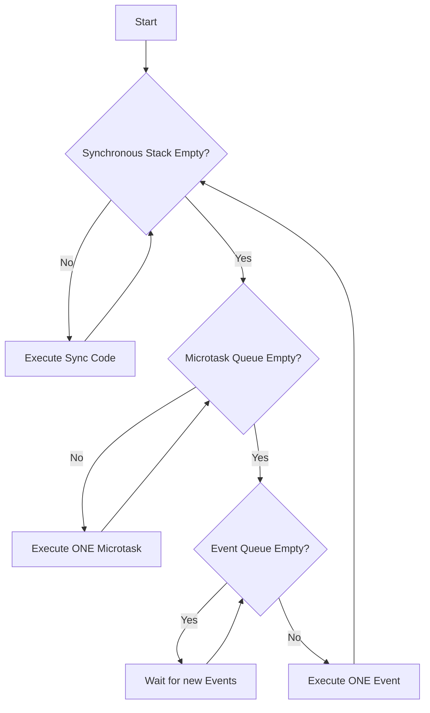

# The Dart Event Loop: The Infinite Heartbeat

To be a senior Flutter engineer, you must stop thinking of `async` as "multi-threading." Dart is single-threaded, but its **Event Loop** is a master of concurrency. Understanding this algorithm is the key to writing jank-free, high-performance applications.

---

## 1. The Core Algorithm (The "PhD" View)

The Event Loop is a simple, infinite loop that governs the execution of all code in a Dart Isolate. It follows a **strict priority system** across two queues and the synchronous stack.



### Rule 1: The Stack is King
All synchronous code (your standard functions) must complete before the loop even looks at a queue.

### Rule 2: Microtasks are High-Priority Continuations
The loop will **never** touch an Event if there is a Microtask waiting. It will drain the *entire* Microtask queue before proceeding.
- **Sources**: `scheduleMicrotask`, `Future.then`, `Future.microtask`, and code resumed after `await`.

### Rule 3: Events are Fair
The loop takes only **one** event at a time, then goes back to check the Microtask queue. This ensures that UI inputs (Events) don't block logic continuations (Microtasks), but also that microtasks don't starve the system for too long.
- **Sources**: I/O, Timers, UI Taps, Platform Channels.

---

## 2. Advanced Execution Order Challenge

Test your senior-level intuition. What is the output of this code?

```dart
void eventLoopMystery() {
  print("1: Sync Start");

  Future(() => print("2: Event (Future)"));

  Future.microtask(() => print("3: Microtask"));

  scheduleMicrotask(() {
    print("4: Nested Microtask");
    scheduleMicrotask(() => print("5: Deeper Microtask"));
  });

  Future.delayed(Duration.zero, () => print("6: Delayed Event"));

  print("7: Sync End");
}
```

### The "PhD" Analysis:
1.  **Sync Code**: Prints `1` and `7`. Tasks `2`, `3`, `4`, and `6` are queued.
2.  **Microtask Queue**: Has `3` and `4`. 
    - Executes `3`.
    - Executes `4`. `4` adds `5` to the microtask queue.
    - Executes `5` (The loop drains the queue completely!).
3.  **Event Queue**: Has `2` and `6`.
    - Takes `2`. Executes it.
    - Loops back to check microtasks (Empty).
    - Takes `6`. Executes it.

**Correct Output**: `1, 7, 3, 4, 5, 2, 6`.

---

## 3. The "Await" State Machine

As a senior, you must understand that `await` is a **suspension point**.

When Dart hits an `await`:
1.  The function execution is **paused**.
2.  The function returns a `Future` to the caller.
3.  The remaining code (the "continuation") is scheduled as a **Microtask** to run once the awaited Future completes.

### Real-World State: 3 Awaits in a Row
```dart
Future<void> drive() async {
  await startEngine(); // Pause 1 -> Microtask 1
  await shiftGear();   // Pause 2 -> Microtask 2
  await accelerate();  // Pause 3 -> Microtask 3
}
```
This is not one task; it is **four distinct segments** of execution interleaved with other work in the event loop.

---

## 4. Visualizing the Dual-Queue System


---

## 5. Senior Summary: Why it Matters

1.  **UI Feedback**: If you run a heavy synchronous loop, the Event Loop never reaches the "Event" that handles your "Back" button tap. The app is frozen.
2.  **Consistency**: By running microtasks first, Dart ensures that the internal state of your app (continuations of logic) is consistent before the user interacts with the next event.
3.  **Optimization**: Use `Future.microtask` when you need to update state *immediately after* the current sync block but *before* the next frame or UI event.

Mastering the Event Loop is the difference between "guessing why there is jank" and "knowing exactly where the pipeline is blocked."
