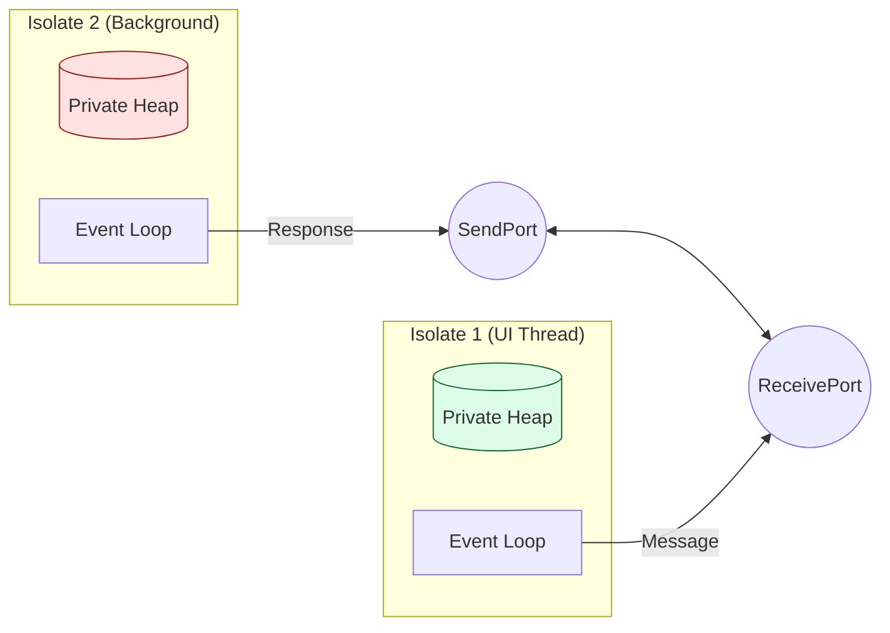
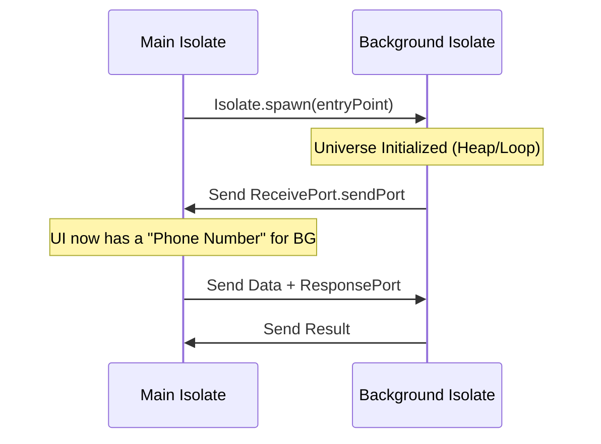

# Dart Isolates and Memory: The Shared-Nothing Architecture

To understand Flutter performance at a PhD level, you must understand that Dart is **not multi-threaded in the traditional sense**. It uses **Isolates**.

## 1. The Shared-Nothing Principle

In languages like Java or C++, threads share the same memory space. This leads to "Race Conditions" and requires "Locks" (Mutexes), which are performance killers.

Dart Isolates have **their own private Heap and their own Event Loop**. They cannot touch each other's memory.



---

## 2. The Isolate Handshake

When you spawn an isolate, you aren't just starting a function; you are initializing a whole new universe.



---

## 3. High-Level Concept: Zero-Copy Optimization

Normally, sending a large object between isolates requires **copying** the memory, which is slow (O(N)).

However, for `Uint8List` (byte arrays), Dart supports **TransferableTypedData**.

```mermaid
graph TD
    subgraph "Heap A"
        Data[Huge Byte Array]
    end
    
    subgraph "Heap B"
        Empty[ ]
    end
    
    Data -- "Transfer (Zero-Copy)" --> Empty
    
    note over Data: Data is 'detached' from A
    note over Empty: Data is 'attached' to B
```

> [!IMPORTANT]
> **PhD Insight**: Zero-copy transfer is essentially a "pointer swap." The memory doesn't move; the **ownership** moves. This is why it's O(1) regardless of data size.

---

## 4. When to use Isolates?

As a senior engineer, don't use isolates for everything. Each isolate has an overhead of roughly **2MB** of memory just to exist.

| Scenario | Use Isolate? | Reason |
| :--- | :--- | :--- |
| Network Requests | No | Handled by OS threads (Async/Await is enough) |
| JSON Parsing (Large) | **Yes** | CPU intensive, can block UI frame (16ms) |
| Image Processing | **Yes** | Heavy math / pixel manipulation |
| Local Database (SQLite) | No | Usually handled by native side threads |

---

## 5. Memory Management: The Generational GC

Dart uses a **Generational Garbage Collector** similar to the JVM.

-   **New Space (Scavenger)**: Frequent, ultra-fast collection for short-lived objects (like Widgets).
-   **Old Space (Mark-Sweep)**: Happens less often, for long-lived objects (like State/Controllers).

Mastering Isolates means you can perform heavy computation without ever dropping a single frame of the UI.
