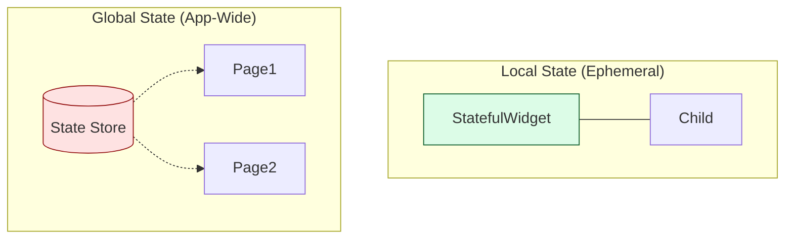
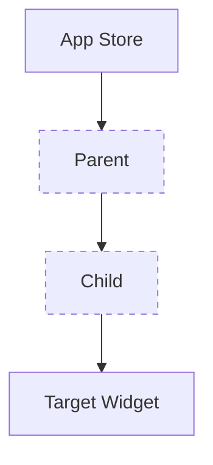
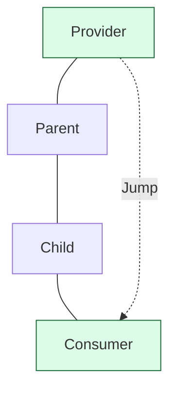
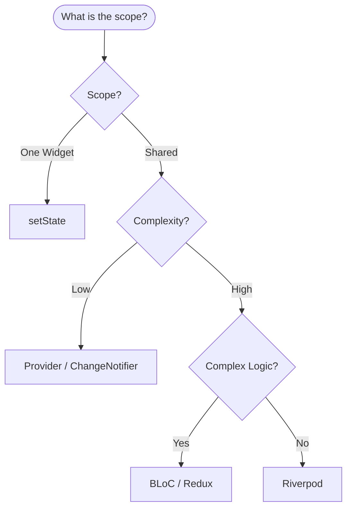

# Flutter State Management Topology: Patterns and Flow

The "PhD" approach to state management is not about picking a favorite library (Riverpod, Bloc, etc.), but about understanding the **Topology of State**.

## 1. Local vs. Global Topology

State is data that changes over time. Its topology defines its scope.

---

## 2. Comparison of Information Flow

A senior engineer must understand how data moves through the tree.

### A. Prop Drilling (The O(N) Nightmare)
Data is passed manually through constructors of intermediate widgets that don't need it.

### B. InheritedWidget (The O(1) Look-up)
Widgets look up the nearest ancestor of a specific type.

---

## 3. The Reactivity Matrix

How does the UI know when to rebuild?

| Pattern | Mechanism | Mental Model |
| :--- | :--- | :--- |
| **Streams/Bloc** | Pipe | `Event In` -> `Logic` -> `State Out` |
| **ChangeNotifier** | Observer | "I changed, everyone look at me!" |
| **Riverpod** | Functional | "I am the declaration of this data." |

---

## 4. Decision Tree: Choosing Your Toolkit

---

## 5. PhD Takeaway: Lifting State Up vs. Dependency Injection

-   **Lifting State Up**: Moving state to a common ancestor so multiple children can access it.
-   **Dependency Injection (DI)**: Decoupling the creation of state from its usage.

> [!TIP]
> **Performance Tip**: Always use `const` constructors where possible. If a widget is `const`, Flutter's element tree can skip the reconciliation for that entire branch, offering a massive performance boost during state updates.

Understanding the topology allows you to design applications that are scalable, testable, and maintainable.
