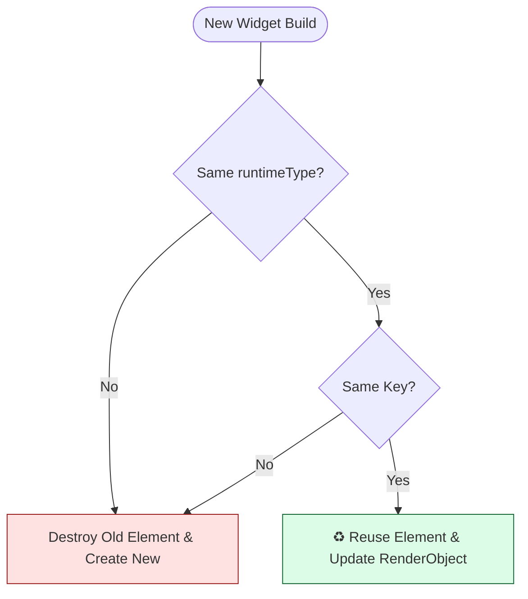
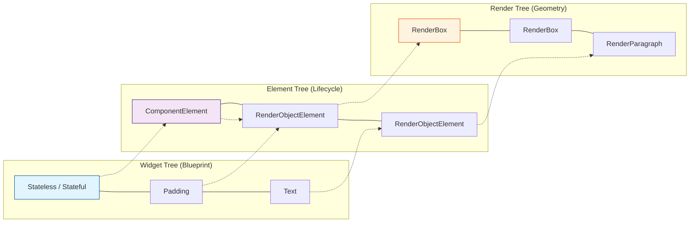
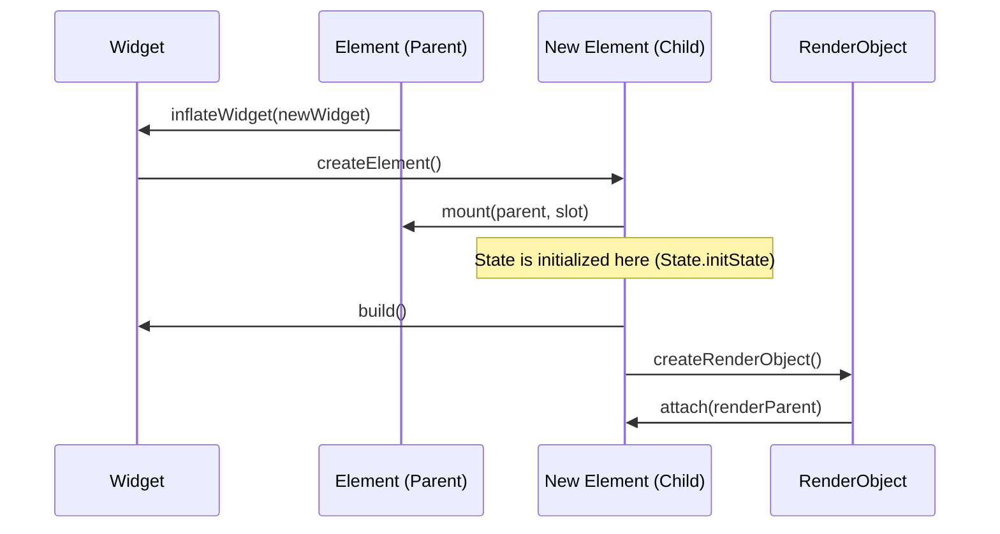

# The Three Trees: The Secret to Flutter's Speed

To reach the "PhD" level of Flutter expertise, you must understand that "Everything is a Widget" is a lie. Everything is actually three distinct trees working in perfect harmony.

## 1. The Trinity of Trees

### A. The Widget Tree (Immutable Blueprint)
- **Nature**: Immutable, lightweight, and transient.
- **Role**: A configuration object. It says, "I want a blue box here."
- **Lifecycle**: Re-created every single time `build()` is called.

### B. The Element Tree (The Glue / Lifecycle Manager)
- **Nature**: Mutable and long-lived.
- **Role**: The "brains" of the operation. It manages the lifecycle of widgets and manages the bridge between the blueprint and the physical object.
- **Key Object**: `BuildContext` is literally an `Element`. When you call `context.view`, you are interacting with this tree.

### C. The RenderObject Tree (The Geometric Reality)
- **Nature**: Heavy, mutable, and persistent.
- **Role**: Handles the actual Layout and Painting. It knows exactly where it is on the screen and how much space it takes.
- **Efficiency**: Only changes when properties actually change, not every time a widget is rebuilt.

---

## 2. Re-conciliation: The Diffing Algorithm

3.  If `true`, the Element stays, and only its **RenderObject** is updated with the new configuration. This is O(N) efficiency.

### Visualizing the Reconciliation Logic (canUpdate)



---

## 3. Visualizing the Magic



> [!NOTE]
> **ComponentElement** (Stateless/Stateful) acts as a container that yields more widgets. 
> **RenderObjectElement** (Padding/Text) physically creates a node in the Render tree.

---

## 4. The Mounting Lifecycle: How Objects are Born

When a widget enters the tree for the first time, it goes through a process called **Inflation**.



---

## 4. Senior Knowledge: Keys and Identity

Why do we need `Keys`? Because the reconciliation algorithm relies on the *index* in the children list. If you reorder a list of stateful widgets, they will lose their state unless you provide a `ValueKey` or `UniqueKey`.

> [!IMPORTANT]
> **Key Rule**: Use keys when you are modifying a collection of stateful widgets (sorting, deleting, inserting). Without them, the Element Tree will map the wrong state to the wrong widget.

---

## 5. Coding Advanced Mechanics: GlobalKey Leakage

A PhD-level engineer knows that `GlobalKey` is powerful but dangerous. It allows a Widget to change parents without losing its Element (and thus its state).

```dart
// Advanced Pattern: Preserving State across the tree
final myGlobalKey = GlobalKey<MyState>();

void moveWidget() {
  // If we move the widget with this key to a different part of the tree,
  // Flutter will "re-parent" the Element instead of destroying it.
  // This preserves scroll positions, animation states, etc.
}
```

---

## 6. The "BuildContext" Epiphany

When you realize that `BuildContext` is just an interface for the `Element` tree, you understand why:
- `Theme.of(context)` works (it walks *up* the Element tree looking for a `ProxyElement`).
- You can't use `context` in an `initState` for certain things (the element isn't fully "mounted" or attached to the tree yet).

Mastering the Three Trees is the difference between writing "code that works" and "code that leverages the Engine."
